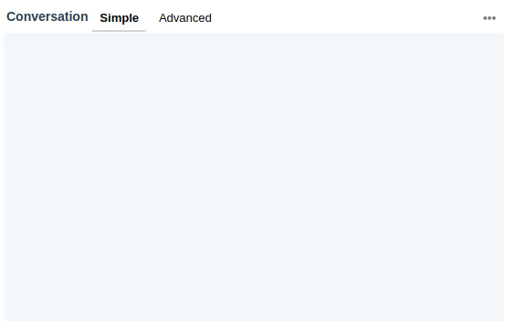

**This example is meant  for the students of the DigEng-Projects.
It can be a staring point for your Assistant.**


# Jovo Template: Hello World on Google Assistant

This exmaple is based on the Hallo-World example from jovo:  
https://www.jovo.tech/templates/helloworld
and 
https://github.com/jovotech/jovo-templates/tree/master/google/01_helloworld/javascript


## Quick Start

you will need the `jovo cli tool`. you can install it via

```sh
$ npm install -g jovo-cli
```


Change your working directory of this project directory and run your voice app:

```sh
# Change working directory to your previously specified directory.
$ cd <directory>

# Install dependencies.
$ npm install

# Run voice app, optionally with a --watch flag to restart on code changes.
$ jovo run [-w]
```

> Read more about `jovo run` [here](https://www.jovo.tech/marketplace/jovo-cli#jovo-run).

If you now go to the [Jovo Debugger](https://www.jovo.tech/marketplace/jovo-plugin-debugger) by pressing `.` or clicking on the webhook url in the terminal, you can test your voice application right away.




Crate a `bundle.zip` (for deployment):
```sh
npm run bundle

#or 

jovo deploy --target zip
```

## Next Steps

 1. use your jovo instance as local backend for dialogflow :
   [Jovo with local Server](./docu/Jovo-run-Dialogflow-locally.md)
 2. Setup Telegram-Bot Integration for Dialogflow: 
   [Jovo with local Server ( See scond part)](./docu/Jovo-run-Dialogflow-locally.md)
 3. Use Google-Cloud function as backend: 
   https://www.jovo.tech/tutorials/deploy-to-google-cloud  
     * you should not need to create a new Google-Function & Bucket
     * if you want to create new Google-Functions pls. get into contact with me so i can create it for you or give you the rights to do so yourself
     * the same is true for Buckets (you should not need to crate one, if so contact me)
 4. Database: this point is still a TODO on my side
  