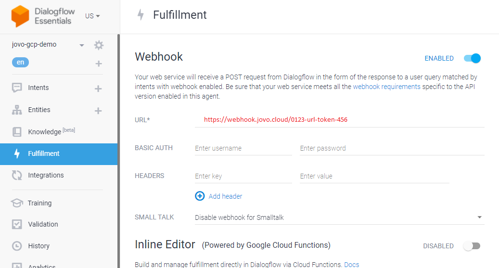
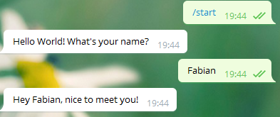

# Run Jovo with Dialogflow locally

We will do the following together:

 1. Add the Dialogflow integration to your project
 
 3. Change Dialogflow-Agent Fullfillment to your local jovo instance
 
 5. Create a Telegram-Bot

 6. Connect that Bot with your Dialogflow-Agent

 7. Test the Telegram Integration

Consult also the resources provided by jovo: 
 https://www.jovo.tech/marketplace/jovo-platform-dialogflow


( For this tutorial you might use an existing jovo-project.  
If you do not have one, create a new one with 
    ```
    $ jovo new <directory> --template helloworld
    ```
) 
## 1. Add Dialogflow integration to your project

For this part also have a look on:
 *  https://www.jovo.tech/marketplace/jovo-platform-dialogflow

##### First you have to add the Dependendy of `jovo-platform-dialogflow` to our project. 

 * [ ] In the file `package.json` add `"jovo-platform-dialogflow": "3.0.21"`to the dependencies (you might use a different Version) 

    ```
    ...
    "dependencies": {
        "jovo-db-filedb": "^3.0.14",
        "jovo-framework": "^3.2.1",
        "jovo-platform-alexa": "^3.0.15",
        "jovo-platform-googleassistant": "^3.0.15",
        "jovo-plugin-debugger": "^3.0.14",
        "jovo-platform-dialogflow": "3.0.21"
    },
    ...
    ```
 * [ ] second we have to download the dependency to our `nodes_modules` folder.  
 Therefore we run: (in your project root folder)
    ```
    npm install
    ```  
<br>

##### Now we have to use the Dialogflow Plugin.
Locate your `app.js` or `app.ts`file : 

* [ ] `import` / `require` the new dependency : 
  ```
  'use strict';

    const { App } = require('jovo-framework');
    const { Dialogflow } = require('jovo-platform-dialogflow');
  ```

* [ ]  locate the code configuring your Jovo `App`: 
  ```
    // ------------------------------------------
    // APP INITIALIZATION
    // ------------------------------------------

    const app = new App();

    app.use(
        new Dialogflow(), // <-- Add the Plugin
        new JovoDebugger(),
        new FileDb()
    );
  ```
  Don't worry that `jovo-platform-dialogflow` does not offer a special integration for Telegram. As there are special integrations for Slack / Facebook which are used in the Tutorial.  
  Dialogflow still enables us to consume the format used by Telegram.

## 2. Set local Webhook as Dialogflow Fulfillment
 Now we run jovo locally and use the jovo-webhook as fullfilment for Dialogflow.

 * [ ] execute `jovo run`.  
   you will see something like: 
   ```
   C:\...Path to project...>jovo run
 
    jovo run: Runs a local development server (webhook).
    >> Learn more: https://jovo.tech/docs/cli/run

    This is your webhook url: https://webhook.jovo.cloud/0123-url-token-456s
    (node:17716) ExperimentalWarning: Package name self resolution is an experimental feature. This feature could change at any ti
    Local server listening on port 3000.

    To open Jovo Debugger in your browser, enter .
   ```
  * [ ] copy the `webhook url` and enter it as your `Dialogflow-Fulfillment`


    
    
    (do not forget to save ... )
  * [ ] Test the connection:
     enter "Hello" into the `"Try it now"` input  on the top right corner of dialogflow.  
     you should now see the `Dialogflow-Request` and `Response` on your console.


## 3. Telegram Integration
Consult also: 
 https://cloud.google.com/dialogflow/es/docs/integrations/telegram

##### Create the Telegram Bot to use

see also https://cloud.google.com/dialogflow/es/docs/integrations/telegram


* [ ] in Telegram chat to https://telegram.me/botfather

   

* [ ] in Dialogflow, locate the Telegram-Integration and activate it. Enter the Token.

    


##### Example Dialog:
* [ ] Now we can chat with the bot (press on the link provided by the botfather):


On the console we should see more details how Dialogflow interacts with our backend:
* have a look on the structure of the Request.  
 These are the information provided by Dialogflow.
    * in `"queryResult": {...}` the NLU Result of Dialogflow. 
    * intersting is, that we also have `"originalDetectIntentRequest": {"source":telegram",...}`
```
...
 >>>>> Request - 2020-11-18T18:44:20.015Z 
{
   "responseId": "ed154d55-4607-4597-9ba6-7190c9bbfb9b-ce5e18e2",
   "queryResult": {
      "queryText": "Fabian",
      "parameters": {
         "name": "Fabian"
      },
      "allRequiredParamsPresent": true,
      "fulfillmentText": "myNameIs worked",
      "fulfillmentMessages": [
         {
            "text": {
               "text": [
                  "myNameIs worked"
               ]
            }
         }
      ],
      "outputContexts": [
         {
            "name": "projects/jovo-gcp/agent/sessions/3986cf83-f641-3e48-9b53-b1a314ef75b3/contexts/__system_counters__",     
            "parameters": {
               "no-input": 0,
               "no-match": 0,
               "name": "Fabian",
               "name.original": "Fabian"
            }
         },
         {
            "name": "projects/jovo-gcp/agent/sessions/3986cf83-f641-3e48-9b53-b1a314ef75b3/contexts/_jovo_ask_ckfpu",
            "parameters": {
               "ask": true,
               "name": "Fabian",
               "name.original": "Fabian"
            }
         }
      ],
      "intent": {
         "name": "projects/jovo-gcp/agent/intents/3048ef28-a21d-4f9a-af3e-83a36e72de4e",
         "displayName": "MyNameIsIntent"
      },
      "intentDetectionConfidence": 1,
      "languageCode": "en"
   },
   "originalDetectIntentRequest": {
      "source": "telegram",
      "payload": {
         "data": {
            "from": {
               "first_name": "Matthias",
               "id": my-Telegram-id,
               "language_code": "en"
            },
            "chat": {
               "type": "private",
               "id": "my-Telegram-id"
            },
            "date": 1605725059,
            "text": "Fabian",
            "message_id": 24
         }
      }
   },
   "session": "projects/jovo-gcp/agent/sessions/3986cf83-f641-3e48-9b53-b1a314ef75b3"
}


 <<<<< Response - 2020-11-18T18:44:20.042Z 
{
   "fulfillmentText": "Hey Fabian, nice to meet you!",
   "outputContexts": []
}

...
```

